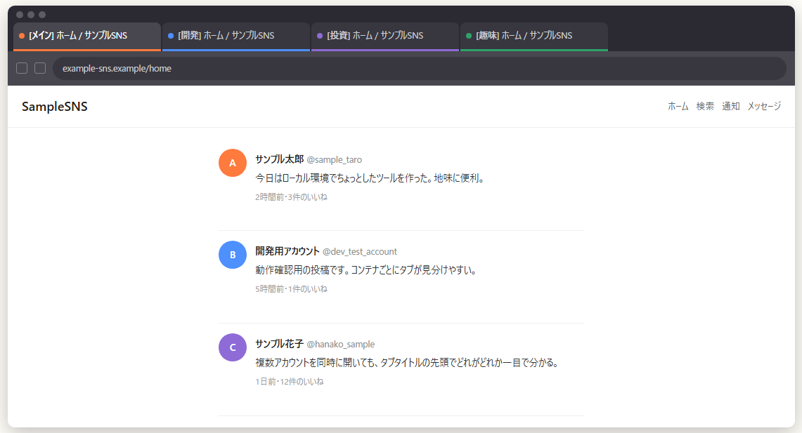

# Tab Title Prefix

Firefox の Multi-Account Containers で複数アカウント（例: X の複数アカウント）を同時に開いていると、タブタイトルがすべて同じで見分けがつかない問題を解決するブラウザ拡張です。タブタイトルの先頭にコンテナ名を自動で差し込みます。

[English README is here](README.md)

## 特徴

- **コンテナ連動が自動** — Multi-Account Containers のコンテナ名を検出し、タブタイトルの先頭に `[コンテナ名] ` を自動挿入します（手動設定不要）
- SPA のルート遷移（例: X のタイムライン → プロフィール）でもプレフィックスを維持
- デフォルトコンテナでは何もしない（既存の見た目を変えません）
- ON/OFF トグル・プレフィックスのフォーマットを options 画面から変更可能

## プライバシーに関する注意

タブタイトルはページの DOM の一部のため、**訪問先のウェブサイトはプレフィックス済みタイトル（コンテナ名を含む）を `document.title` で読み取れます**。コンテナ名に機微な単語（銀行名など）を含めている場合は、中立的な名前にするか、プレフィックスの書式をカスタマイズすることを検討してください。

## 対応ブラウザ

- **Phase 1（現在）**: Firefox（Multi-Account Containers 前提）
- **Phase 2（予定）**: Chrome 対応 + 手動 URL ルール機能

## インストール

- **Firefox**: [Firefox Add-ons（AMO）からインストール](https://addons.mozilla.org/addon/tab-title-prefix/)
- **Chrome**: 未対応（Phase 2 で対応予定）

ローカルビルド・開発者向けの手順は以下を参照してください。

## ローカルビルド・開発者向け

1. このリポジトリをクローン
2. Firefox で `about:debugging` を開く
3. 「この Firefox」→「一時的なアドオンを読み込む」を選択
4. `src/extension/manifest.json` を選択

## ライセンス

[MIT](LICENSE)
