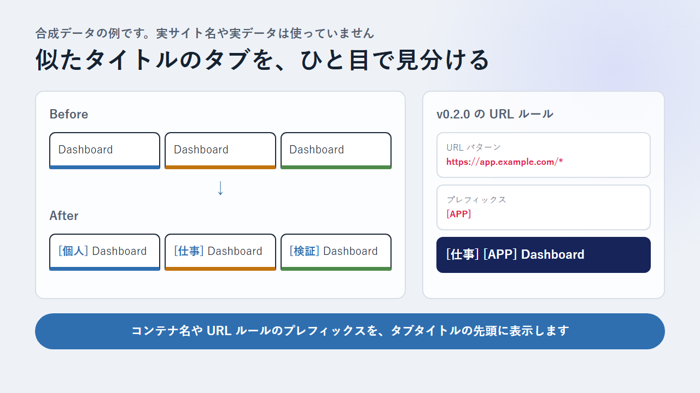

# Tab Title Prefix

Firefox のコンテナ名またはユーザー定義の URL ルールに応じて、タブタイトルの先頭にプレフィックスを付けるブラウザ拡張です。似たタイトルのタブを見分けやすくします。

[English README is here](README.md)

## 特徴

- **コンテナ連動が自動** — Multi-Account Containers のコンテナ名を検出し、タブタイトルの先頭に `[コンテナ名] ` を自動挿入します（手動設定不要）
- **URL ルール** — `https://github.com/*` などの URL パターンに一致したページへ任意のプレフィックスを付けられます
- URL ルールの並び替え、一括停止、現在のタブからのルール作成に対応
- URL ルール保存前に、タブタイトルのプレビューを確認可能
- SPA のルート遷移（例: ダッシュボード → 詳細ページ）でもプレフィックスを維持
- デフォルトコンテナでは何もしない（既存の見た目を変えません）
- ON/OFF トグル・コンテナテンプレート・URL ルールを options 画面から変更可能

## プライバシーに関する注意

タブタイトルはページの DOM の一部のため、**訪問先のウェブサイトはプレフィックス済みタイトル（コンテナ名や URL ルールのプレフィックスを含む）を `document.title` で読み取れます**。コンテナ名に機微な単語（銀行名など）を含めている場合は、中立的な名前にするか、プレフィックスの書式をカスタマイズすることを検討してください。

## 対応ブラウザ

- **Firefox**: コンテナプレフィックス + URL ルール
- **Chrome**: URL ルール

## インストール

- **Firefox**: [Firefox Add-ons（AMO）からインストール](https://addons.mozilla.org/addon/tab-title-prefix/)
- **Chrome**: Chrome Web Store にはまだ未公開です。当面はローカル開発ビルドを使ってください。

ローカルビルド・開発者向けの手順は以下を参照してください。

## ローカルビルド・開発者向け

1. このリポジトリをクローン
2. `pwsh scripts/build.ps1 -Browser firefox` または `pwsh scripts/build.ps1 -Browser chrome` を実行
3. Firefox: `about:debugging` を開き、「この Firefox」→「一時的なアドオンを読み込む」から `build/packages/firefox/manifest.json` を選択
4. Chrome: `chrome://extensions` を開き、デベロッパーモードを有効にして「パッケージ化されていない拡張機能を読み込む」から `build/packages/chrome` を選択

## ライセンス

[MIT](LICENSE)
