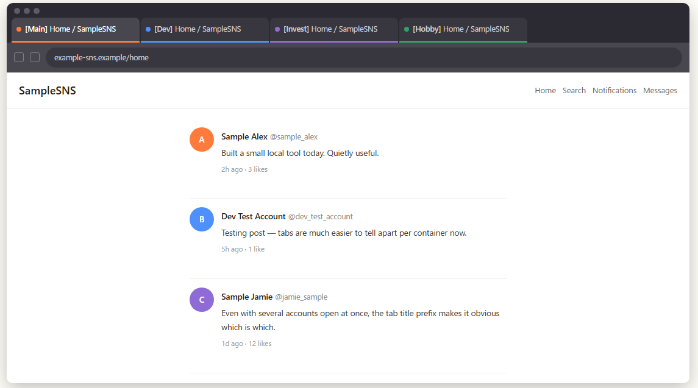

# Tab Title Prefix

A browser extension that solves the problem of indistinguishable tabs when using Firefox's Multi-Account Containers to keep multiple accounts (e.g. multiple X accounts) open at once. It automatically prepends the container name to the tab title.

[日本語版 README はこちら](README.ja.md)

## Features

- **Automatic container linking** — detects the Multi-Account Containers name and automatically prepends `[container name] ` to the tab title (no manual setup required)
- Keeps the prefix even after SPA route changes (e.g. X timeline → profile)
- Does nothing in the default container (keeps the existing look unchanged)
- ON/OFF toggle and prefix format can be changed from the options page

## Privacy Note

The tab title is part of the page DOM, so **websites you visit can read the prefixed title** (including your container name) via `document.title`. If your container names contain sensitive words (e.g. a bank name), consider using neutral names or a custom prefix format.

## Supported Browsers

- **Phase 1 (current)**: Firefox (requires Multi-Account Containers)
- **Phase 2 (planned)**: Chrome support + manual URL rules

## Installation

- **Firefox**: [Get it on Firefox Add-ons (AMO)](https://addons.mozilla.org/addon/tab-title-prefix/)
- **Chrome**: not yet supported (planned for Phase 2)

For local/development builds, see below.

## Local Build / For Developers

1. Clone this repository
2. Open `about:debugging` in Firefox
3. Select "This Firefox" → "Load Temporary Add-on…"
4. Select `src/extension/manifest.json`

## License

[MIT](LICENSE)
