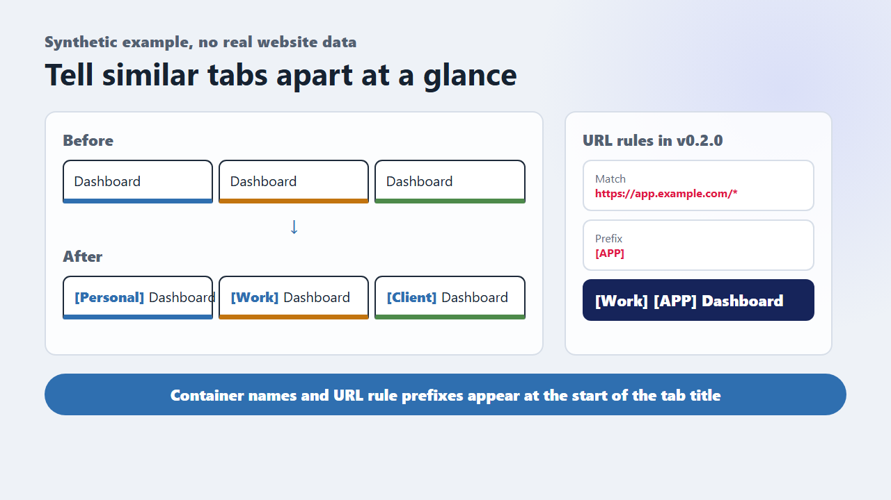

# Tab Title Prefix

A browser extension that prefixes tab titles with Firefox container names or user-defined URL rules, making similar tabs easier to tell apart.

[日本語版 README はこちら](README.ja.md)

## Features

- **Automatic container linking** — detects the Multi-Account Containers name and automatically prepends `[container name] ` to the tab title (no manual setup required)
- **URL rules** — prepends custom prefixes for matching URL patterns such as `https://github.com/*`
- Reorder URL rules, pause all URL rules, and create a rule from the current tab
- Preview the resulting tab title before saving a URL rule
- Keeps the prefix even after SPA route changes (e.g. dashboard → detail page)
- Does nothing in the default container (keeps the existing look unchanged)
- ON/OFF toggle, container template, and URL rules can be changed from the options page

## Privacy Note

The tab title is part of the page DOM, so **websites you visit can read the prefixed title** (including your container name or URL rule prefix) via `document.title`. If your container names contain sensitive words (e.g. a bank name), consider using neutral names or a custom prefix format.

## Supported Browsers

- **Firefox**: container prefixes + URL rules
- **Chrome**: URL rules

## Installation

- **Firefox**: [Get it on Firefox Add-ons (AMO)](https://addons.mozilla.org/addon/tab-title-prefix/)
- **Chrome**: Chrome Web Store listing is not published yet; use a local development build for now.

For local/development builds, see below.

## Local Build / For Developers

1. Clone this repository
2. Run `pwsh scripts/build.ps1 -Browser firefox` or `pwsh scripts/build.ps1 -Browser chrome`
3. Firefox: open `about:debugging`, select "This Firefox" → "Load Temporary Add-on…", then select `build/packages/firefox/manifest.json`
4. Chrome: open `chrome://extensions`, enable Developer mode, select "Load unpacked", then select `build/packages/chrome`

## License

[MIT](LICENSE)
